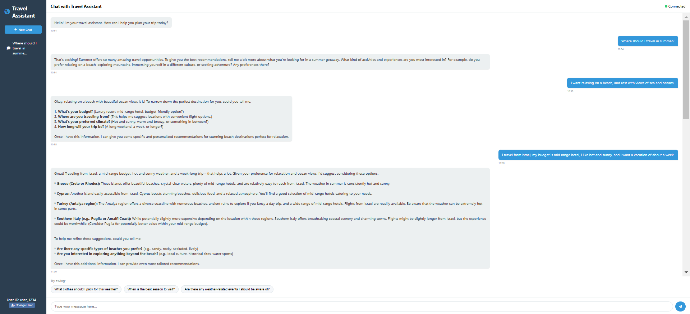
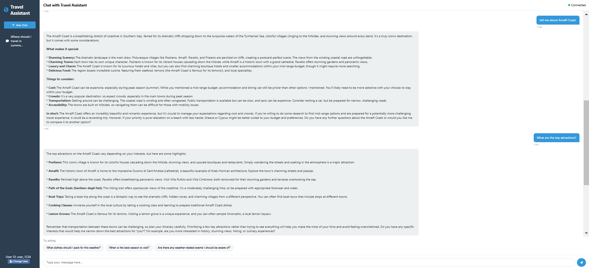
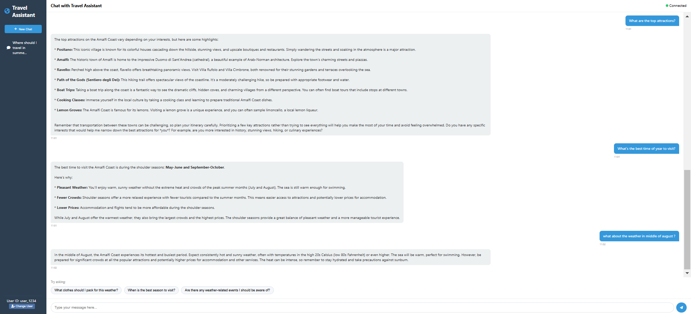

# Travel Assistant - Conversation Examples

Below are some examples of conversations with the Travel Assistant app to demonstrate its capabilities.

## Example 1: Travel Recommendations

The assistant can provide personalized travel recommendations based on your preferences and interests.

## Example 2: Local Attractions Information

Get information about popular attractions and points of interest at your destination.

## Example 3: Trip Planning Assistance

The assistant can help with detailed trip planning including packing suggestions, weather information, and more.

